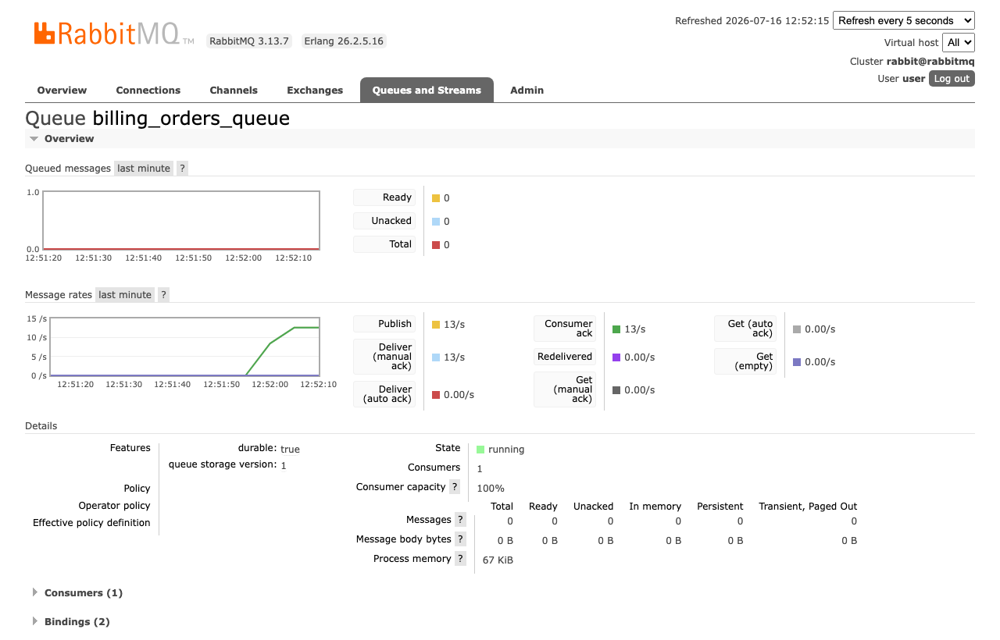
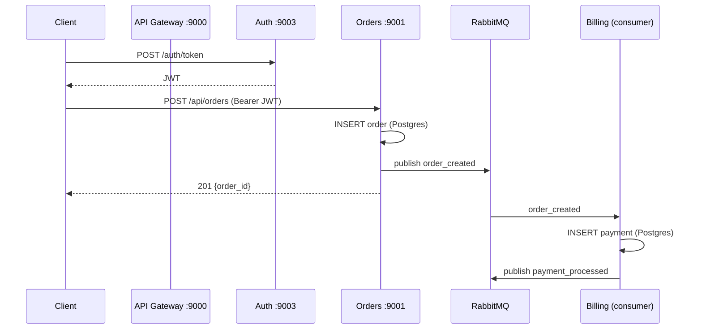
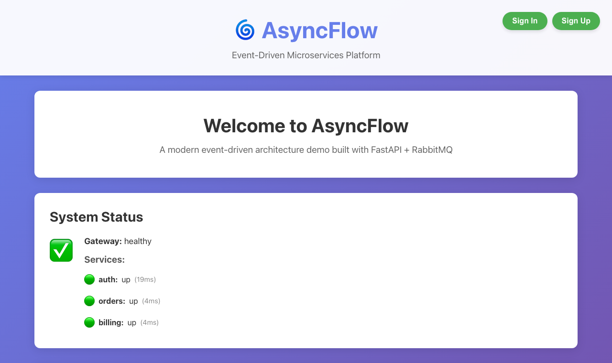

# AsyncFlow


**Event-driven microservices platform** — 4 FastAPI services + React frontend coordinating through RabbitMQ. One `docker compose up` boots the whole system: gateway, auth (JWT), orders, billing consumer, Postgres (3 DBs), RabbitMQ, frontend.

**The queue under live load — publisher and consumer in balance, zero backlog:**



## How an order flows



Services never call each other over HTTP — **all cross-service communication is events** through a durable topic exchange. Kill billing, create orders, restart billing: it catches up from the queue. That's the point of the architecture.

## See it work

```bash
cp .env.example .env
docker compose up --build      # 8 containers, ~2 min first build
```

```bash
# 1. get a token
TOKEN=$(curl -s -X POST localhost:9003/auth/token \
  -d 'username=demo&password=Demo12345!' | jq -r .access_token)

# 2. create an order
curl -X POST localhost:9001/api/orders \
  -H "Authorization: Bearer $TOKEN" -H 'Content-Type: application/json' \
  -d '{"user_id": 1, "amount": 49.90}'
# → {"order_id":6,"message":"Order created and event published"}

# 3. watch billing consume it
docker logs asyncflow_billing --tail 2
# → Payment processed: order_id=6
```

**Aggregate health across the fleet** — the gateway polls every service; the frontend renders it:



## Services

| Service | Port | Responsibility |
|---|---|---|
| api_gateway | 9000 | Routing, aggregate `/health`, request forwarding |
| auth_service | 9003 | JWT issuance and validation, Alembic migrations |
| order_service | 9001 | Create orders, publish `order_created` events |
| billing_service | — | Consume events, process payments, publish `payment_processed`; stdlib `/health` on 9002 |
| frontend | 3000 | React + nginx status dashboard |
| RabbitMQ | 5672 / 15672 | Topic exchange + management UI (`user`/`pass`) |
| Postgres | 5432 | Three isolated databases, one per service |

## Design notes

**Queue consumers still need `/health`.** Billing has no web framework — it serves liveness from a 20-line stdlib `ThreadingHTTPServer` so the gateway and k8s probes treat it like any other service. No FastAPI dependency for one endpoint.

**Case-insensitive settings.** All services read config via pydantic-settings; `case_sensitive = True` was silently discarding `DB_HOST` from compose and falling back to defaults — the kind of bug that "works on my machine" hides. Removed everywhere.

**Serialization at the boundary.** Events are pydantic models; `model_dump_json()` — not `json.dumps(model_dump())` — because `Decimal` and `datetime` must survive the trip through the broker.

## Docs

See [docs/development.md](docs/development.md) for make commands and deployment notes.

## License

MIT
